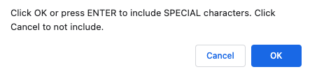

# Passoword Generator
This repository holds the contents of generate random passwords based on criteria that you’ve selected so that we can create a strong password that provides greater security.
# Dependencies
 - HTML
 - CSS
 - Javascripts
 # Usage
 You can run a local copy of this site by issuing the following commands. 
```bash
$ git clone https://github.com/vi3t4lov3/HW3-Password-Generator.git
$ cd HW3-Password-Generator
```
## Contributing
1. Fork it
2. Create your feature branch (`git checkout -b my-new-feature`)
3. Commit your changes (`git commit -am 'Add some feature'`)
4. Push to the branch (`git push origin my-new-feature`)
5. Create new Pull Request
## The Font Page


- As the user will have to enter how many characters you want to generate
  


- The user will choose the lowercase includes or not
  


- The user will choose the uppercase includes or not
  


- The user will choose the number includes or not
  


- The user will choose the special characters includes or not
  


- The final result
  
